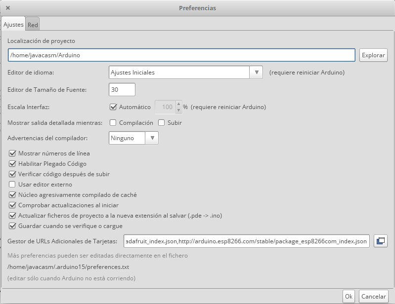
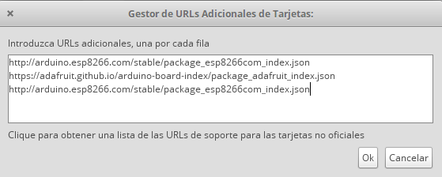
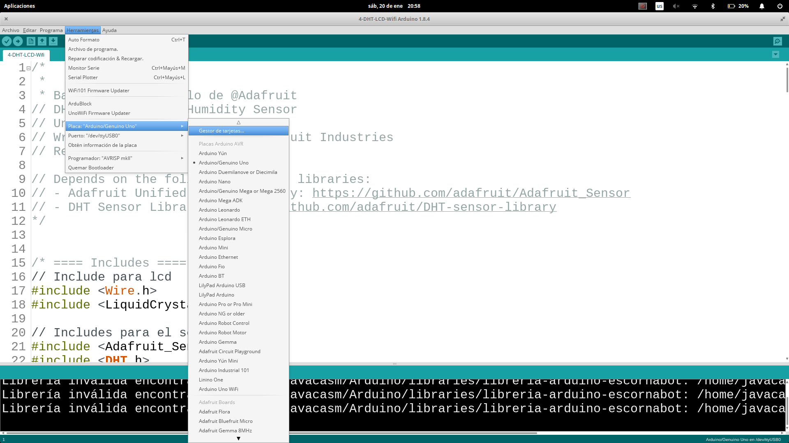
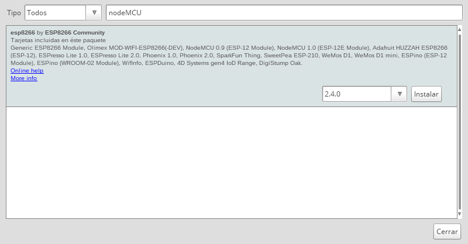
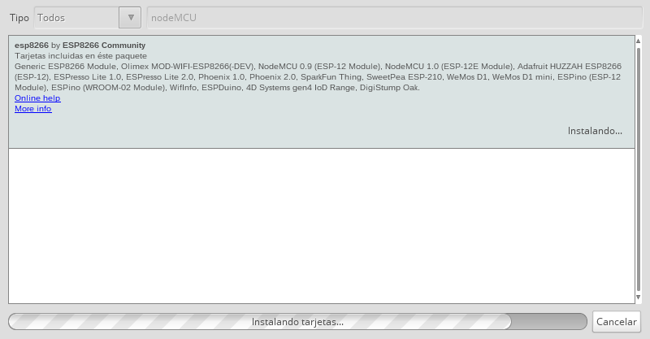
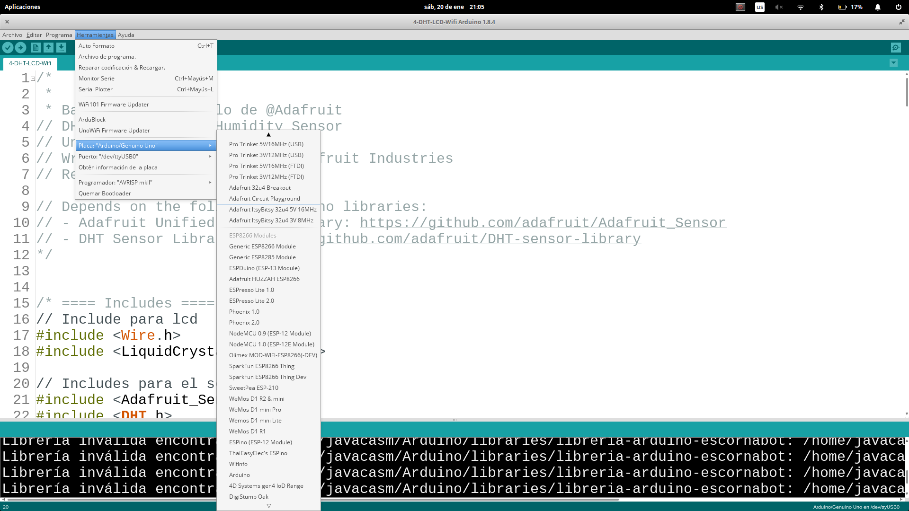
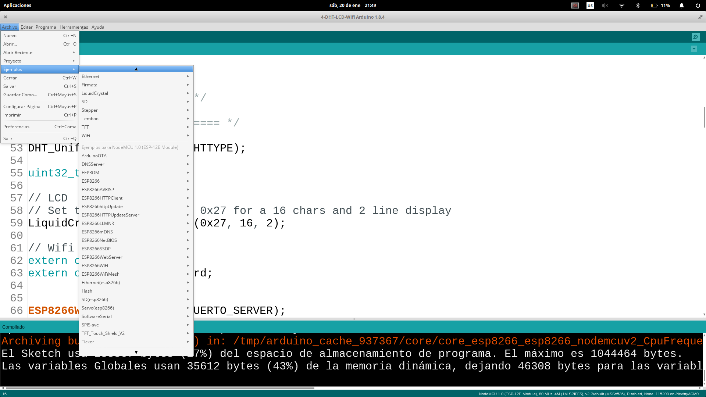

## Config entorno (IDE) de Arduino

En preferences, añadimos el siguiente url en la caja del gestor de tarjetas
    http://arduino.esp8266.com/stable/package_esp8266com_index.json

Ahora abrimos el gestor de tarjetas desde el menú Herramientas

En la caja de búsqueda del gestor de Tarjetas escribimos "NodeMCU"

Y pulsamos "Instalar"

Ahora tendremos disponibles las tarjetas de tipo esp8266

Seleccionamos NodeMCU 1.0

Ahora tendremos mucho ejemplos de la nueva plataforma

Para windows instalamos los drivers

https://www.silabs.com/products/development-tools/software/usb-to-uart-bridge-vcp-drivers

https://www.silabs.com/documents/public/software/CP210x_Windows_Drivers.zip
